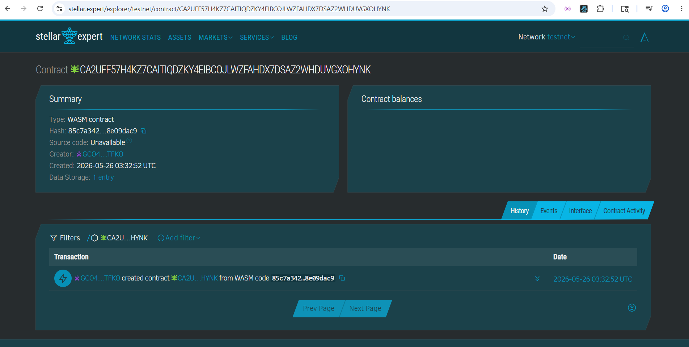

# PayLinya

A real-time QR payment system for street vendors and students using Stellar.

## Problem
Street vendors in Quezon City lose daily income due to slow cash payments and lack of instant digital payment trust.

## Solution
PayLinya enables instant USDC payments on Stellar using Soroban smart contracts that verify and record transactions instantly.

---

## Timeline
- Day 1: Smart contract setup
- Day 2: Frontend QR payment app
- Day 3: Wallet integration
- Day 4: Testing & demo

---

## Stellar Features Used
- USDC transfers
- Soroban smart contracts
- Trustlines

---

## Vision
Enable instant, low-cost payments for everyday street commerce in Southeast Asia.

---

## Prerequisites
- Rust
- Soroban CLI
- Stellar testnet account

---

## Build
soroban contract build

## Test
cargo test

## Deploy
soroban contract deploy

---

## Sample Call
pay(student_address, 100)

---

## License
MIT

## Contract ID
CA2UFF57H4KZ7CAITIQDZKY4EIBCOJLWZFAHDX7DSAZ2WHDUVGXOHYNK

## Link
https://stellar.expert/explorer/testnet/contract/CA2UFF57H4KZ7CAITIQDZKY4EIBCOJLWZFAHDX7DSAZ2WHDUVGXOHYNK

## Screenshot
